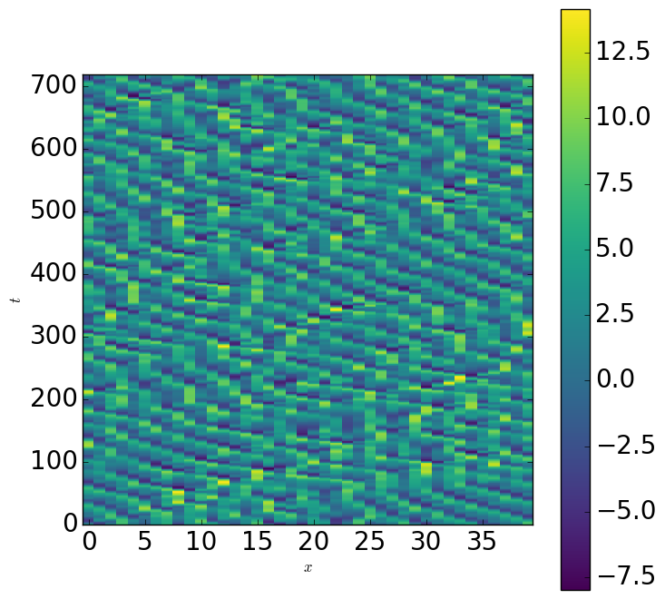

# Lorenz96 model with data assimilation

## About
The Lorenz96 model is a defact standard model in data assimilatin studies. The model is defined as follows.  
x_{i-1}-x_{i}+F\left(\forall{i}=1,\ldots,N\right))  
Here is an illustration of 40-variables Lorenz96 simulation result for . 
  
This model shows chaotic behaviour with , but shows
periodic or more chaotic behaviours with  and . Using this model, we perform an observing system simulation
experiment (OSSE) with the presence of model biases. We first perform raw simulations with  as `Nature` runs. We then add Gaussian noises to these simulation results of `Nature` runs to get mock `Observation` data. Our primary task is to predict the `Nature` run using the simulation states with  and the mock `Observation` data obtained from different `Nature` runs using multiple  values with .

## Run
To run simulations, several command line arguments are necessary. Following table summarizes the list of commad line arguments for run mode.
The detailed settings are defined in an input file stored in [cases/simulation](../cases/simulation). If the model works, a symbolic link `<case_name>` to `<out_dir>/<case_name>/results` will be created wherein the simulation results are stored. Both `<case_name>` and `<out_dir>` are set in the input file as described in the following. For DA simulations, we need to complete Nature or Perturbed run beforehand, which is used as Ground Truth (Observations are made for these simulation results) for DA simulations. 

| Run mode | Command | Explanation |
| --- | --- | --- |
| Nature run | ```python run.py --filename dns.json``` | Vanilla Lorenz96 simulation |
| Perturbed run | ```python run.py --filename perturbed.json``` | Lorenz96 simulation with perturbation |
| Run with Nudging | ```python run.py  --model_name Nudging --filename nudging.json``` | Lorenz96 simulation with nudging |
| Ensemble Run with EnKF | ```python run.py --model_name EnKF --filename enkf.json``` | Ensemble simulations with EnKF |
| Ensemble Run with LETKF | ```python run.py --model_name LETKF --filename letkf.json``` | Ensemble simulations with LETKF |
| Ensemble Run without DA | ```python run.py --model_name NoDA --filename debug_kf.json``` | Ensemble simulations without DA |
| Run with Generative EnKF | ```python run.py --model_name EFDA --filename efda.json``` | Simulation with Generative EnKF |

### Input parameters
For input parameters, there are three categories `settings`, `grids`, and `simulation`.  
1. LETKF
An input json file for [LETKF](../cases/simulation/letkf.json) is 

```json
{
    "settings": {
        "out_dir": "<path-to-the-result-directory>",
        "case_name": "LETKF",
        "in_case_name": "Perturbed"
    },
    "grids": {
        "Nx":40
    },
    "simulation": {
        "model": "DNS",
        "F":8,
        "diag_chunk":10,
        "diag_steps":1,
        "dt":0.05,
        "mode":"default",
        "perturbation_amp":0.00001,
        "nbiter":720,
        "u0_factor":1.001,
        "u0_idx":19,
        "n_ens":32,
        "obs_interval":1,
        "kalman_filter":"letkf",
        "n_local":6,
        "beta":1.0,
        "sigma":1.0
    }
}
```
The simulation results with DA will be stored under `<out_dir/case_name>`. The observation data are assumed to be stored under `<out_dir/in_case_name>`.

2. Generative EnKF
An input json file for [Generative EnKF](../cases/simulation/efda.json) is  

```json
{
    "settings": {
        "out_dir": "<path-to-the-result-directory>",
        "case_name": "EFDA",
        "in_case_name": "Perturbed"
    },
    "nn_settings": {
        "nn_model_type": "nn",
        "batch_size": 1,
        "inference_mode": true,
        "model_dir": "diffusion_test_obs2",
        "da_steps": 1,
        "kalman_filter":"none_kf",
        "n_ens": 32
    }
}
```
The simulation results with DA will be stored under `<out_dir/case_name>`. The observation data are assumed to be stored under `<out_dir/in_case_name>`. Simulation settings are also loaded from the setting json file at `<out_dir/in_case_name>`.
The pretrained diffusion model state should be placed at `<out_dir/model_dir>`.

## Use Lorenz96 simulator to construct dataset
We use Lorenz96 simulator to construct the dataset for the deep learning model.
We run ensemble simulations with different initial values and convert the simulation data to the dataset format. 
The detailed settings are defined in an input file stored in [cases/dataset_factory](../cases/dataset_factory). 

```bash
python run.py --model_name DatasetFactory --filename dataset_factory.json
python convert.py --filename dataset_factory.json --start_idx 0  --end_idx 90  --mode train
python convert.py --filename dataset_factory.json --start_idx 90 --end_idx 95  --mode val
python convert.py --filename dataset_factory.json --start_idx 95 --end_idx 100 --mode test
```

Under the dataset dirctory `<case_name>`, the training, valdiation and test data are placed in the following manner.
```
---/
 |--meta.txt
 |--dataset/
 |  |--train/
 |  |    |--shot000000.nc
 |  |    |--shot000001.nc
 |  |    |--...
 |  |    
 |  |--val/
 |  |    |--shot000000.nc
 |  |    |--shot000001.nc
 |  |    |--... 
 |  |    
 |  └──test/
 |       |--shot000000.nc
 |       |--shot000001.nc
 |       |--... 
 |
 └──results/
    |--log.txt
    |--enkf_stats0000.nc
    |--enkf_stats0000.nc
    |--...
    | 
    |--ens_idx000/
    |--ens_idx001/
    |--...
    └──ens_idx099/
```

## Postscript
To visualize, several command line arguments are necessary. Following table summarizes the list of commad line arguments for postscripting.
The detailed settings are defined in an input file stored in [cases/simulation](../cases/simulation). 
If the model works, a symbolic link `<case_name>` to `<out_dir>/<case_name>/imgs` will be created wherein the simulation results are stored. 
Both `<case_name>` and `<out_dir>` are set in the input file as described in the following. 
For LESs, we need to complete DNS run beforehand, which is used as Ground Truth.

| Run mode | Command | Explanation |
| --- | --- | --- |
| Nature run | ```python post.py --filename dns.json``` | Vanilla Lorenz96 simulation |
| Perturbed run | ```python post.py --filename perturbed.json``` | Lorenz96 simulation with perturbation |
| Run with Nudging | ```python post.py  --model_name Nudging --filename nudging.json``` | Lorenz96 simulation with nudging |
| Ensemble Run with EnKF | ```python post.py --model_name EnKF --filename enkf.json``` | Ensemble simulations with EnKF |
| Ensemble Run with LETKF | ```python post.py --model_name LETKF --filename letkf.json``` | Ensemble simulations with LETKF |
| Ensemble Run without DA| ```python post.py --model_name NoDA --filename debug_kf.json``` | Ensemble simulations without DA |
| Run with Generative EnKF | ```python post.py --model_name EFDA --filename efda.json``` | Simulation with Generative EnKF |

## Reference
```bibtex
@article {Lorenz96,
      author = "Edward N. Lorenz and Kerry A. Emanuel",
      title = "Optimal Sites for Supplementary Weather Observations: Simulation with a Small Model",
      journal = "Journal of the Atmospheric Sciences",
      year = "1998",
      publisher = "American Meteorological Society",
      address = "Boston MA, USA",
      volume = "55",
      number = "3",
      doi = "https://doi.org/10.1175/1520-0469(1998)055<0399:OSFSWO>2.0.CO;2",
      pages = "399 - 414",
      url = "https://journals.ametsoc.org/view/journals/atsc/55/3/1520-0469_1998_055_0399_osfswo_2.0.co_2.xml"
}
```
